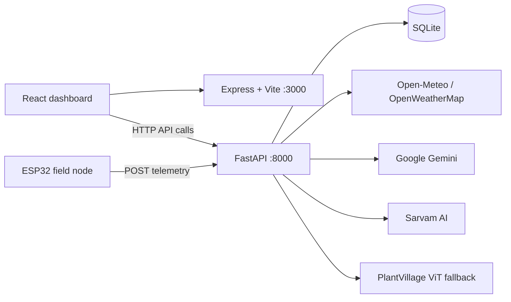

# Harvex

Harvex is an AI-assisted smart farming platform for Indian farmers. It combines field telemetry, irrigation decision support, plant-leaf disease analysis, crop recommendations, weather context, multilingual agronomy chat, and voice assistance in one responsive dashboard.

> **Project status:** The repository contains a working prototype with a React dashboard, an Express/Vite web server, and a FastAPI service. Some dashboard values and interactions are intentionally local/static; see [Current Limitations](#current-limitations).

## Contents

- [What Harvex Does](#what-harvex-does)
- [Architecture](#architecture)
- [Repository Layout](#repository-layout)
- [Prerequisites](#prerequisites)
- [Installation](#installation)
- [Configuration](#configuration)
- [Running the Project](#running-the-project)
- [Frontend](#frontend)
- [Backend API](#backend-api)
- [Express Helper API](#express-helper-api)
- [Telemetry and Irrigation Logic](#telemetry-and-irrigation-logic)
- [Storage](#storage)
- [Testing](#testing)
- [Production Build](#production-build)
- [Troubleshooting](#troubleshooting)
- [Current Limitations](#current-limitations)
- [Development Notes](#development-notes)

## What Harvex Does

- **Farm dashboard:** Shows crop health, soil moisture, temperature, humidity, pump state, alerts, and irrigation guidance.
- **ESP32 telemetry ingestion:** Accepts device readings for soil moisture, temperature, humidity, and pump status.
- **Irrigation decision support:** Compares soil moisture with a configurable dry threshold and rain probability before recommending pump activation.
- **Leaf disease analysis:** Accepts a plant-leaf image and uses Gemini Vision when configured, with a PlantVillage Vision Transformer fallback.
- **Crop recommendations:** Suggests crops using the farm profile, soil type, irrigation, season, and region.
- **Weather context:** Uses Open-Meteo by default and can use OpenWeatherMap when an API key is configured.
- **Agronomy chat:** Supports English and Hindi text chat, with multilingual-oriented voice/query flows and Gemini/rule-based fallbacks.
- **Voice assistance:** Provides Sarvam AI speech-to-text and text-to-speech through backend endpoints; the active call interface also records audio in the browser.
- **History and profile:** Stores the onboarding farm profile in browser `localStorage` and maintains dashboard history in frontend state.

## Architecture



The application is split into two local services:

1. **Express/Vite server (`server.ts`)** serves the React application and exposes two lightweight helper endpoints.
2. **FastAPI backend (`backend/main.py`, `backend/routes.py`)** owns telemetry, weather, persistence, disease analysis, recommendations, chat, and voice APIs.

The frontend runs on port `3000`. Most backend calls target `http://localhost:8000`, so both services should be running for the complete experience.

## Repository Layout

```text
.
├── index.html                 Vite HTML entrypoint
├── package.json               Node dependencies and scripts
├── package-lock.json          Locked Node dependency versions
├── server.ts                 Express server and Vite integration
├── vite.config.ts            Vite and Tailwind configuration
├── tsconfig.json              TypeScript configuration
├── .env.example              Safe environment variable template
├── frontend/                 Frontend workspace marker
├── src/
│   ├── main.tsx              React entrypoint
│   ├── App.tsx               Application state and view routing
│   ├── data.ts               Initial dashboard/history data
│   ├── types.ts              Shared frontend types
│   ├── index.css             Global styles
│   └── components/           Dashboard views and modals
├── backend/
│   ├── main.py               FastAPI application and middleware
│   ├── routes.py             `/api` route handlers
│   ├── database.py           SQLite schema and persistence helpers
│   ├── decision.py           Irrigation and crop-health decisions
│   ├── weather.py             Weather providers and cache
│   ├── model.py               Gemini and PlantVillage disease analysis
│   ├── sarvam.py              Sarvam TTS/STT integration
│   ├── schemas.py             Pydantic request/response models
│   ├── test_backend.py        Backend contract tests
│   └── requirements.txt       Python dependencies
└── assets/                   Static project assets
```

## Prerequisites

- Node.js 18 or newer and npm.
- Python 3.10 or newer.
- A modern browser for camera, microphone, and browser speech features.
- Optional API credentials:
  - Google Gemini for hosted AI analysis and chat.
  - Sarvam AI for Indian-language TTS/STT.
  - OpenWeatherMap for the optional weather provider.

## Installation

### Node dependencies

```bash
npm install
```

### Python dependencies

From the repository root:

```bash
python -m venv .venv
```

Activate the virtual environment:

```bash
# Windows PowerShell
.\.venv\Scripts\Activate.ps1

# Windows Command Prompt
.venv\Scripts\activate.bat

# macOS/Linux
source .venv/bin/activate
```

Install the backend and test dependencies:

```bash
pip install -r backend/requirements.txt
pip install -r requirements.txt
```

Copy the environment template and fill in the credentials you intend to use:

```bash
# Windows PowerShell
Copy-Item .env.example .env

# macOS/Linux
cp .env.example .env
```

Never commit `.env`. It is ignored by Git; `.env.example` is the safe file to share.

## Configuration

The backend loads environment variables with `python-dotenv`. The root `.env.example` contains the three primary values:

```dotenv
SARVAM_API_KEY="your-sarvam-api-key"
GEMINI_API_KEY="your-gemini-api-key"
APP_URL="http://localhost:3000"
```

The following variables are also read by the source code:

| Variable | Used by | Default | Purpose |
| --- | --- | --- | --- |
| `GEMINI_API_KEY` | backend and Express | empty | Gemini Vision, chat, and recommendations |
| `SARVAM_API_KEY` | backend | empty | Backend TTS and STT |
| `VITE_SARVAM_API_KEY` | `VoiceCallModal` | empty | Optional browser-side Sarvam STT key |
| `VITE_BACKEND_URL` | `VoiceCallModal` | `http://localhost:8000` | FastAPI base URL |
| `OPENWEATHER_API_KEY` | `backend/weather.py` | empty | Optional OpenWeatherMap access |
| `FIELD_LATITUDE` | `backend/weather.py` | `28.6139` | Default field latitude |
| `FIELD_LONGITUDE` | `backend/weather.py` | `77.2090` | Default field longitude |
| `RAIN_THRESHOLD` | weather and decisions | `0.5` | Rain probability above this is treated as rain expected |
| `DRY_THRESHOLD` | `backend/decision.py` | `30.0` | Soil moisture percentage below this is dry |
| `MAX_PUMP_RUNTIME_SECONDS` | `backend/decision.py` | `30` | Recommended maximum pump runtime |
| `WEATHER_CACHE_TTL` | `backend/weather.py` | `600` | Weather cache duration in seconds |
| `HARVEX_DB_PATH` | `backend/database.py` | `backend/harvex.db` | SQLite database path |
| `APP_URL` | environment template | unset | Deployment/application URL metadata |
| `NODE_ENV` | `server.ts` | development | Selects Vite middleware or production static serving |
| `DISABLE_HMR` | `vite.config.ts` | unset | Disables Vite HMR/file watching when set |

For production, keep all API keys server-side. In particular, `VITE_SARVAM_API_KEY` is bundled into browser code when used and should only be configured when that exposure is acceptable.

## Running the Project

Start the FastAPI backend in one terminal:

```bash
uvicorn backend.main:app --host 0.0.0.0 --port 8000 --reload
```

Start the React/Express development server in a second terminal:

```bash
npm run dev
```

Open:

- Dashboard: `http://localhost:3000`
- FastAPI Swagger UI: `http://localhost:8000/docs`
- FastAPI ReDoc: `http://localhost:8000/redoc`
- FastAPI root: `http://localhost:8000/`

The backend can alternatively be started from its directory:

```bash
cd backend
python main.py
```

## Frontend

`src/App.tsx` owns the main application state: active tab, language, farm profile, sensors, history, and modal visibility. The onboarding profile is saved under the `user_farm_profile` browser `localStorage` key.

| Component | Responsibility |
| --- | --- |
| `TopAppBar` | Branding, desktop navigation, language switcher, weather, and settings actions |
| `BottomNavBar` | Mobile navigation |
| `DashboardView` | Farm profile, crop health, irrigation action, alerts, recommendations, and sensor cards |
| `LeafCheckView` | Image upload/camera capture, sample images, disease request, confidence, and advisory |
| `ChatView` | Text agronomy chat, quick prompts, and browser speech playback |
| `HistoryView` | Local irrigation, disease, alert, and operation history with filters/details |
| `OnboardingModal` | Initial state, district, soil, and irrigation profile setup |
| `SettingsModal` | Farm profile editing and persistence |
| `WeatherModal` | Weather display and irrigation advisory |
| `VoiceCallModal` | Press-and-hold recording, Sarvam transcription, voice query, and audio playback |
| `VoiceAssistantModal` | Older browser SpeechRecognition/Sarvam TTS flow; currently not mounted by `App` |
| `HarvexUI.jsx` | Wrapper around `App`; not the active entrypoint |

The UI supports English and Hindi labels. The backend voice query additionally detects Hinglish, Kannada, Tamil, and Telugu language codes.

## Backend API

FastAPI routes are defined under the `/api` prefix in `backend/routes.py`. Validation errors from Pydantic are returned as HTTP `400` responses by the application exception handler.

### `POST /api/sensor-data`

Ingests a telemetry reading and persists it as both historical and latest device data.

```json
{
  "device_id": "harvex-node-1",
  "timestamp": "2026-08-26T10:15:00Z",
  "soil_moisture_pct": 42.0,
  "temperature_c": 28.5,
  "humidity_pct": 61.0,
  "pump_status": "off"
}
```

Required fields are `device_id`, `timestamp`, `soil_moisture_pct`, `temperature_c`, `humidity_pct`, and `pump_status`. Moisture and humidity must be between `0` and `100`; pump status must be `on` or `off`.

Response:

```json
{"status": "received"}
```

### `GET /api/pump-command?device_id=harvex-node-1`

Reads the latest telemetry and cached weather forecast, then returns the irrigation recommendation:

```json
{
  "pump_command": "on",
  "max_runtime_seconds": 30,
  "display_message": "Watering: dry soil"
}
```

Possible decisions are:

| Condition | Command | Message |
| --- | --- | --- |
| Moisture below `DRY_THRESHOLD`, no rain expected | `on` | `Watering: dry soil` |
| Moisture below threshold, rain expected | `off` | `Rain expected: skipping` |
| Moisture is adequate | `off` | `Soil moisture optimal` |

When no telemetry exists, the decision layer uses a default moisture value of `42%`.

### `POST /api/detect-disease?lang=en|hi`

Accepts an optional multipart form field named `image`:

```bash
curl -X POST "http://localhost:8000/api/detect-disease?lang=en" \
  -F "image=@/path/to/leaf.jpg"
```

Gemini Vision is used when `GEMINI_API_KEY` is configured. Otherwise the service performs vegetation screening and attempts the `kimcomehome/plantvillage-vit-leaf-disease` model. Corrupt, non-leaf, low-confidence, or failed analyses return `disease_class: "uncertain"` rather than failing the request. Confidence below `0.70` is treated as uncertain. Hindi requests may include Sarvam-generated `voice_audio_base64`.

### `GET /api/status?device_id=harvex-node-1&lang=en`

Aggregates latest sensors, last watering time, weather state, crop health, and the latest disease result. It uses fallback sensor values when the device has not sent telemetry. The crop health score can be `Healthy`, `Needs Water`, `Disease Risk`, or `Needs Water + Disease Risk`. Hindi requests may include a synthesized audio summary.

### Voice endpoints

#### `POST /api/voice/synthesize`

JSON body:

```json
{
  "text": "Namaste kisan bhai",
  "language": "hi",
  "speaker": "meera"
}
```

Returns `audio_base64` and `language`. When Sarvam is unavailable, `audio_base64` is empty.

#### `POST /api/voice/transcribe`

Accepts multipart `file` and form `language`, then returns:

```json
{"transcript": "फसल में खाद कब डालनी चाहिए", "language": "hi"}
```

#### `POST /api/chat-voice`

Accepts `message` or `transcript`, optional `language` and farm context, generates a text answer, and attempts to attach Sarvam audio. The response includes text/reply fields, audio fields, and fallback metadata.

#### `POST /api/voice-query`

Accepts `device_id`, `transcript`, and a BCP-47 `language`. It gathers sensor, disease, and weather context, generates a short agronomy response, optionally synthesizes audio, and returns `response_text`, `response_audio_base64`, and `action_taken`.

### `POST /api/recommend-crops`

Accepts a farm profile plus optional month, season, and language:

```json
{
  "farm_profile": {
    "state": "Maharashtra",
    "district": "Nagpur",
    "soil_type": "black",
    "irrigation": "drip"
  },
  "month": 8,
  "season": "Kharif",
  "language": "en"
}
```

Gemini returns structured recommendations when configured. The fallback chooses regional recommendations for black/regur soil, sandy/arid/desert soil, or default alluvial/loamy soil. Each recommendation contains crop name, yield, water requirement, and suitability reason.

### `POST /api/chat` and `POST /api/chat-text`

Accepts `message` and optional `language`, `farm_profile`, and `sensor_context`. Gemini is attempted first; the local fallback handles identity, disease, fertilizer, crop, irrigation, weather, greetings, and general agronomy questions.

### `GET /`

Returns a small service health/project payload with project name, team, online status, and the docs path.

## Express Helper API

`server.ts` exposes these separate routes on port `3000`:

### `GET /api/health`

Returns:

```json
{"status": "ok", "service": "Harvex Agricultural Intelligence"}
```

### `POST /api/analyze-leaf`

Accepts a JSON base64 image payload. It uses `@google/genai` when `GEMINI_API_KEY` is available; otherwise it returns a hardcoded tomato Early Blight fallback. This endpoint is separate from FastAPI `/api/detect-disease` and does not have the same response contract.

### `POST /api/voice-assistant`

Accepts `message`, `language`, and optional `farmContext`. Gemini is used when available; otherwise keyword-based fallback answers are returned.

## Telemetry and Irrigation Logic

The backend decision layer in `backend/decision.py` follows this model:

```text
water_needed = soil_moisture_pct < DRY_THRESHOLD
rain_expected = rain_probability > RAIN_THRESHOLD
pump_on = water_needed AND NOT rain_expected
```

Disease risk requires a disease result that is neither `Healthy` nor `uncertain`, with confidence of at least `0.70`. The status endpoint combines water and disease risk into the crop-health score.

Weather behavior:

- Open-Meteo provides a no-key default provider.
- OpenWeatherMap is available when `OPENWEATHER_API_KEY` is set.
- Results are cached in memory for `WEATHER_CACHE_TTL` seconds.
- On provider failure, rain is treated as not expected so crops are not unnecessarily denied water.

## Storage

SQLite is initialized by `backend/database.py`. The default database is `backend/harvex.db`; override it with `HARVEX_DB_PATH`.

Tables:

- `sensor_history`: timestamped telemetry readings.
- `latest_sensors`: latest reading per device.
- `latest_disease`: latest disease result.

There is no irrigation-command table. `last_watered` is derived from telemetry where `pump_status == "on"`. The frontend's history is currently in-memory and does not read `sensor_history`.

## Testing

Run the backend suite from the repository root:

```bash
pytest backend/test_backend.py -v
```

The suite covers 19 tests for:

- Root health and API contracts.
- Valid and malformed telemetry.
- Invalid pump status.
- Adequate-soil, dry-soil, and rain-aware pump decisions.
- Corrupt/non-leaf/uncertain disease images.
- Status aggregation and combined water/disease risk.
- Sarvam TTS/STT response contracts.
- Hindi voice attachments.
- Crop recommendations.
- Text and voice chat.

Run the TypeScript check with:

```bash
npm run lint
```

This runs `tsc --noEmit`; despite its name, it is a typecheck rather than an ESLint run.

## Production Build

Build the frontend and bundled Express server:

```bash
npm run build
```

Start the resulting server:

```bash
npm start
```

The production Express server serves `dist` and listens on port `3000` unless the server implementation is configured otherwise. The FastAPI service remains a separately deployed process and should still be started with Uvicorn.

Other npm commands:

| Command | Purpose |
| --- | --- |
| `npm run dev` | Start Express with Vite development middleware |
| `npm run build` | Build Vite assets and bundle `server.ts` |
| `npm start` | Run the bundled production Express server |
| `npm run preview` | Preview the Vite build |
| `npm run lint` | Run TypeScript no-emit checking |
| `npm run clean` | Remove build outputs; uses Unix `rm -rf` syntax |

## Troubleshooting

### The dashboard loads but AI features fail

Run both servers. The browser UI is on port `3000`, while disease analysis, recommendations, chat, and most voice flows call port `8000`. Check FastAPI at `http://localhost:8000/docs`.

### Gemini or Sarvam responses are empty

Verify the corresponding key in `.env`, restart FastAPI after changing environment variables, and check provider network access. The backend intentionally falls back to local/rule-based responses when providers are unavailable.

### Disease analysis takes a long time

Without Gemini, the PlantVillage Transformer may download model files and perform CPU inference. The first request can therefore be slow and resource-intensive.

### Camera or microphone access is denied

Use a secure browser origin such as localhost, grant browser permissions, and ensure no other application is holding the device. Voice recording depends on `MediaRecorder` support.

### Windows cleanup command fails

`npm run clean` is written with Unix `rm -rf`. On PowerShell, remove generated output with:

```powershell
Remove-Item -Recurse -Force dist -ErrorAction SilentlyContinue
```

## Current Limitations

- The dashboard initially displays static values from `src/data.ts`; it does not continuously poll `/api/status`.
- Manual watering updates React state and local history only. It does not operate a physical pump or call `/api/pump-command`.
- Frontend history is local in-memory state rather than SQLite-backed history.
- The weather modal currently displays static weather/forecast values and does not directly consume `backend/weather.py`.
- FastAPI and Express both expose some AI-related functionality, but their request and response schemas differ. Use the FastAPI routes for the documented backend contract.
- Relative `/api/*` fallback calls from the frontend can resolve to Express on port `3000`, while most complete backend contracts live on port `8000`.
- `VoiceAssistantModal` is implemented but not currently rendered by `App`; the active flow is `VoiceCallModal`.
- Browser-side `VITE_SARVAM_API_KEY` exposes that credential to the client bundle. Prefer the backend voice endpoints for production secrets.
- CORS is permissive (`*` with credentials enabled) and should be restricted to known origins before production deployment.
- External Gemini, Sarvam, weather, and model services are network-dependent and have provider-specific limits and failure modes.
- The database path is computed when `database.py` imports. If overriding `HARVEX_DB_PATH`, ensure environment loading occurs before importing the database module.
- The local model and generated SQLite database are runtime artifacts and are intentionally ignored by Git.

## Development Notes

- Keep secrets in `.env`; update `.env.example` when adding a new required setting.
- Keep API request and response changes synchronized between `backend/schemas.py`, `backend/routes.py`, and frontend callers.
- Add or update `backend/test_backend.py` when changing backend contracts or decision thresholds.
- Use `npm run lint` after TypeScript/React changes and `pytest backend/test_backend.py -v` after backend changes.
- The application is designed around a field device identifier such as `harvex-node-1`; use a stable `device_id` when posting telemetry.

## License

No license file is currently included in this repository.
