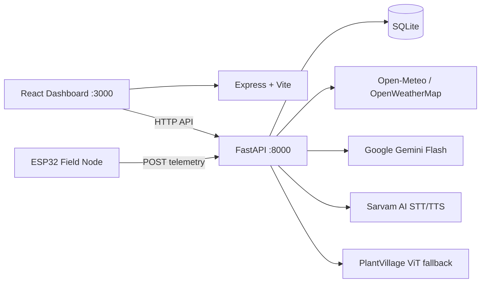

# Harvex — AI Smart Farming Assistant

**Team Goldsmiths · Smart India Hackathon 2026 · SIH26180**

> *Code by Code, Till its Gold.*

Harvex is an AI-assisted smart farming platform built for Indian farmers. It combines real-time field telemetry from an ESP32 sensor node, automated irrigation control, plant-leaf disease detection, crop recommendations, weather-aware alerts, and a multilingual voice assistant — all in one responsive web dashboard.

The system was fully built and demonstrated during SIH 2026, with a live ESP32 node connected end-to-end to the backend and dashboard.

---

## Contents

- [What Harvex Does](#what-harvex-does)
- [Architecture](#architecture)
- [Repository Layout](#repository-layout)
- [Prerequisites](#prerequisites)
- [Installation](#installation)
- [Configuration](#configuration)
- [Running the Project](#running-the-project)
- [Frontend](#frontend)
- [Backend API](#backend-api)
- [Express Helper API](#express-helper-api)
- [ESP32 Firmware](#esp32-firmware)
- [Telemetry and Irrigation Logic](#telemetry-and-irrigation-logic)
- [Storage](#storage)
- [Testing](#testing)
- [Production Build](#production-build)
- [Troubleshooting](#troubleshooting)
- [Current Limitations](#current-limitations)
- [Development Notes](#development-notes)

---

## What Harvex Does

- **Live farm dashboard** — crop health score, soil moisture, temperature, humidity, pump state, weather alerts, and irrigation guidance updated from a real ESP32 node.
- **Automated irrigation** — the backend compares live soil moisture against a configurable dry threshold and checks rain probability before sending a pump on/off command back to the ESP32 relay.
- **Leaf disease detection** — farmer uploads or photographs a crop leaf; Gemini Vision analyses it when online, with a PlantVillage Vision Transformer as an offline fallback.
- **Crop recommendations** — suggests the best crops for the farmer's location, soil type, irrigation method, and current season, with Gemini-generated reasoning or a Karnataka/Maharashtra regional rule-based fallback.
- **Weather alerts** — monitors for storms, extreme heat, frost, and heavy rain using Open-Meteo (no key required) or OpenWeatherMap. Alerts are shown prominently on the dashboard and communicated through the voice assistant.
- **Multilingual voice assistant** — WhatsApp-style hold-to-record interface. Farmer holds the mic button, speaks in English or Hindi, releases — the recording is transcribed by Sarvam AI STT, answered by the backend using live farm context, and spoken back via Sarvam TTS. Supports full Hinglish understanding.
- **Agronomy chat** — text-based farming Q&A in English and Hindi, powered by Gemini with a local rule-based fallback for offline use.
- **History** — irrigation events, disease detections, and alerts logged locally in the dashboard.

---

## Architecture



Two local services run in parallel:

1. **Express/Vite server (`server.ts`)** — serves the React dashboard on port `3000` and exposes two lightweight helper endpoints.
2. **FastAPI backend (`backend/main.py`)** — owns all telemetry, irrigation decisions, disease analysis, crop recommendations, weather, chat, and voice API endpoints on port `8000`.

The ESP32 firmware pushes sensor readings to FastAPI every 5–10 seconds and polls for pump commands on the same interval.

---

## Repository Layout

```text
.
├── index.html                  Vite HTML entrypoint
├── package.json                Node dependencies and scripts
├── package-lock.json           Locked Node dependency versions
├── server.ts                   Express server and Vite integration
├── vite.config.ts              Vite and Tailwind configuration
├── tsconfig.json               TypeScript configuration
├── .env.example                Safe environment variable template
├── src/
│   ├── main.tsx                React entrypoint
│   ├── App.tsx                 Application state and view routing
│   ├── data.ts                 Initial dashboard/history data
│   ├── types.ts                Shared frontend types
│   ├── index.css               Global styles
│   └── components/
│       ├── TopAppBar           Branding, navigation, language switcher
│       ├── BottomNavBar        Mobile navigation
│       ├── DashboardView       Main farm dashboard
│       ├── LeafCheckView       Disease detection UI
│       ├── ChatView            Text agronomy chat
│       ├── HistoryView         Event history with filters
│       ├── OnboardingModal     First-run farm profile setup
│       ├── SettingsModal       Profile editing
│       ├── WeatherModal        Weather display and forecast
│       └── VoiceCallModal      Hold-to-record voice assistant (active)
├── backend/
│   ├── main.py                 FastAPI app, CORS, middleware
│   ├── routes.py               /api route handlers
│   ├── database.py             SQLite schema and helpers
│   ├── decision.py             Irrigation and crop-health decisions
│   ├── weather.py              Weather providers and caching
│   ├── model.py                Gemini Flash + PlantVillage disease analysis
│   ├── sarvam.py               Sarvam STT/TTS integration
│   ├── schemas.py              Pydantic request/response models
│   ├── test_backend.py         Backend contract tests (19 tests)
│   └── requirements.txt        Python dependencies
└── assets/                     Static project assets
```

---

## Prerequisites

- **Node.js 18+** and npm
- **Python 3.10+**
- A modern browser with microphone and camera support (Chrome recommended)
- Optional API credentials:
  - **Google Gemini** — for AI-powered disease analysis, chat, and crop recommendations
  - **Sarvam AI** — for Indian-language speech-to-text and text-to-speech
  - **OpenWeatherMap** — alternative weather provider (Open-Meteo works without a key)

---

## Installation

### Node dependencies

```bash
npm install
```

### Python dependencies

Create and activate a virtual environment:

```bash
python -m venv .venv

# Windows PowerShell
.\.venv\Scripts\Activate.ps1

# Windows Command Prompt
.venv\Scripts\activate.bat

# macOS / Linux
source .venv/bin/activate
```

Install backend and test dependencies:

```bash
pip install -r backend/requirements.txt
pip install -r requirements.txt
```

Copy the environment template:

```bash
# macOS / Linux
cp .env.example .env

# Windows PowerShell
Copy-Item .env.example .env
```

Fill in your API keys in `.env`. Never commit this file — it is already ignored by Git.

---

## Configuration

The backend loads environment variables using `python-dotenv`. The Vite frontend exposes variables prefixed with `VITE_` to browser code.

| Variable | Used by | Default | Purpose |
|---|---|---|---|
| `GEMINI_API_KEY` | Backend + Express | — | Gemini Flash for disease analysis, chat, and recommendations |
| `SARVAM_API_KEY` | Backend | — | Backend Sarvam STT and TTS |
| `VITE_SARVAM_API_KEY` | VoiceCallModal (browser) | — | Optional browser-side Sarvam STT key |
| `VITE_BACKEND_URL` | VoiceCallModal | `http://localhost:8000` | FastAPI base URL for voice calls |
| `OPENWEATHER_API_KEY` | `backend/weather.py` | — | Optional OpenWeatherMap provider |
| `FIELD_LATITUDE` | `backend/weather.py` | `28.6139` | Field latitude for weather queries |
| `FIELD_LONGITUDE` | `backend/weather.py` | `77.2090` | Field longitude for weather queries |
| `DRY_THRESHOLD` | `backend/decision.py` | `30.0` | Soil moisture % below which the field is considered dry |
| `RAIN_THRESHOLD` | Weather + decisions | `0.5` | Rain probability above which rain is expected |
| `MAX_PUMP_RUNTIME_SECONDS` | `backend/decision.py` | `30` | Recommended maximum relay-on duration sent to ESP32 |
| `WEATHER_CACHE_TTL` | `backend/weather.py` | `600` | Weather cache duration in seconds |
| `HARVEX_DB_PATH` | `backend/database.py` | `backend/harvex.db` | SQLite database file path |
| `APP_URL` | Template | — | Deployment URL metadata |
| `NODE_ENV` | `server.ts` | `development` | Switches between Vite middleware and production static serving |

> **Field location:** Set `FIELD_LATITUDE` and `FIELD_LONGITUDE` in `.env` to match the demo or deployment location. The defaults point to Delhi and should be updated for any real deployment.

> **Security note:** `VITE_SARVAM_API_KEY` is bundled into browser JavaScript. Prefer the backend `/api/voice/transcribe` endpoint in production to keep credentials server-side.

---

## Running the Project

Start the FastAPI backend in one terminal:

```bash
uvicorn backend.main:app --host 0.0.0.0 --port 8000 --reload
```

Start the React/Express development server in a second terminal:

```bash
npm run dev
```

Then open:

| URL | Purpose |
|---|---|
| `http://localhost:3000` | Harvex dashboard |
| `http://localhost:8000/docs` | FastAPI Swagger UI |
| `http://localhost:8000/redoc` | FastAPI ReDoc |
| `http://localhost:8000/` | Backend health check |

The backend can also be started directly:

```bash
cd backend
python main.py
```

---

## Frontend

`src/App.tsx` manages the main application state: active tab, language (English/Hindi), farm profile, sensor readings, history, and modal visibility. The onboarding farm profile is persisted to `localStorage` under the key `user_farm_profile`.

| Component | Responsibility |
|---|---|
| `TopAppBar` | Branding, desktop navigation, language switcher, weather and settings access |
| `BottomNavBar` | Mobile navigation |
| `DashboardView` | Crop health score, irrigation action, sensor cards, alerts, and recommendations |
| `LeafCheckView` | Camera/upload capture, disease request, confidence display, and advisory |
| `ChatView` | Text agronomy chat with quick prompts and browser speech playback |
| `HistoryView` | Local irrigation, disease, alert, and operation history with filters |
| `OnboardingModal` | Initial farm profile setup (state, district, soil type, irrigation) |
| `SettingsModal` | Farm profile editing and localStorage persistence |
| `WeatherModal` | Current weather display and forecast-based irrigation advisory |
| `VoiceCallModal` | **Active voice interface** — hold-to-record (WhatsApp-style), Sarvam transcription, backend voice query, and audio playback |

### Voice assistant flow

1. Farmer holds the mic button → `MediaRecorder` starts capturing audio
2. Farmer releases the button → recording stops, audio Blob is ready
3. Audio is sent to Sarvam STT → transcript returned
4. Transcript posted to `/api/voice-query` with farm context
5. Backend generates a short plain-language response using live sensor data, disease results, and weather
6. Response audio from Sarvam TTS is decoded and played automatically
7. Mic button returns to idle — farmer initiates the next message manually

The interface displays a scrollable chat-style history of the conversation with the farmer's transcripts on the right and Harvex responses on the left. Each response bubble includes a replay button.

---

## Backend API

All routes are defined under the `/api` prefix in `backend/routes.py`. Pydantic validation errors are returned as HTTP `400` responses.

### `POST /api/sensor-data`

Ingests a telemetry reading from the ESP32 and persists it.

```json
{
  "device_id": "harvex-node-1",
  "timestamp": "2026-08-26T10:15:00Z",
  "soil_moisture_pct": 42.0,
  "temperature_c": 28.5,
  "humidity_pct": 61.0,
  "pump_status": "off"
}
```

All fields are required. Moisture and humidity must be `0–100`; pump status must be `"on"` or `"off"`.

Response: `{"status": "received"}`

---

### `GET /api/pump-command?device_id=harvex-node-1`

Returns the current irrigation recommendation based on live telemetry and weather.

```json
{
  "pump_command": "on",
  "max_runtime_seconds": 30,
  "display_message": "Watering: dry soil"
}
```

| Condition | Command | Message |
|---|---|---|
| Moisture below `DRY_THRESHOLD`, no rain expected | `on` | `Watering: dry soil` |
| Moisture below threshold, rain expected | `off` | `Rain expected: skipping` |
| Moisture adequate | `off` | `Soil moisture optimal` |

When no telemetry exists, a default moisture of `42%` is used.

---

### `POST /api/detect-disease?lang=en|hi`

Accepts a multipart form field named `image` containing a crop leaf photo.

```bash
curl -X POST "http://localhost:8000/api/detect-disease?lang=en" \
  -F "image=@/path/to/leaf.jpg"
```

**When `GEMINI_API_KEY` is set:** Gemini Flash analyses the image directly.  
**When offline or Gemini unavailable:** Falls back to the `kimcomehome/plantvillage-vit-leaf-disease` Vision Transformer model.

Confidence below `0.70`, non-leaf images, or corrupt uploads return `disease_class: "uncertain"` rather than failing the request. Hindi requests include an optional `voice_audio_base64` field.

---

### `GET /api/status?device_id=harvex-node-1&lang=en`

Aggregates the complete farm state for the dashboard.

```json
{
  "device_id": "harvex-node-1",
  "soil_moisture_pct": 42,
  "temperature_c": 28.5,
  "humidity_pct": 61,
  "pump_status": "off",
  "last_watered": "2026-08-26T09:40:00Z",
  "rain_expected": false,
  "weather_alert": {
    "active": true,
    "type": "storm",
    "message": "Heavy storm expected in 4 hours. Avoid field activity."
  },
  "crop_health_score": "Needs Water",
  "last_disease_result": {
    "disease_class": "uncertain",
    "confidence": 0.31,
    "advisory": "No photo uploaded yet."
  }
}
```

`crop_health_score` is one of: `Healthy` / `Needs Water` / `Disease Risk` / `Needs Water + Disease Risk`.

Weather alert types: `storm`, `extreme_heat`, `frost`, `heavy_rain`. `weather_alert.active` is `false` when no alert is active.

---

### Voice endpoints

#### `POST /api/voice/synthesize`

```json
{
  "text": "Namaste kisan bhai",
  "language": "hi",
  "speaker": "meera"
}
```

Returns `audio_base64` and `language`. Returns an empty `audio_base64` when Sarvam is unavailable.

#### `POST /api/voice/transcribe`

Accepts multipart `file` (audio) and form field `language`. Returns:

```json
{"transcript": "फसल में खाद कब डालनी चाहिए", "language": "hi"}
```

#### `POST /api/voice-query`

The primary voice assistant endpoint. Accepts a transcript from the frontend, gathers live farm context (sensors, disease result, weather), generates a short plain-language agronomy response using Gemini, optionally synthesizes audio via Sarvam TTS, and returns:

```json
{
  "response_text": "Your soil is dry. The pump has been turned on automatically.",
  "response_audio_base64": "<base64 wav>",
  "action_taken": "pump_on"
}
```

`action_taken` is only present when the voice query triggered a system action. The response is limited to 2–3 sentences for natural spoken delivery.

The endpoint correctly handles intent-based questions:

| Question type | Example | Response behaviour |
|---|---|---|
| Identity | "What is your name?" | Introduces itself as Harvex |
| Disease/pest | "My plant has a virus, what fertilizer?" | Gives specific treatment advice |
| Crop advice | "Best crop this season?" | Uses location + soil + season |
| Irrigation | "Should I water today?" | References live soil moisture + forecast |
| Weather | "Is a storm coming?" | References active weather alert |
| Greeting | "Hello / Namaste" | Friendly greeting + one-line status |

#### `POST /api/chat-voice`

Accepts `message` or `transcript`, optional `language` and farm context. Returns text response with optional Sarvam audio.

---

### `POST /api/recommend-crops`

```json
{
  "farm_profile": {
    "state": "Maharashtra",
    "district": "Nagpur",
    "soil_type": "black",
    "irrigation": "drip"
  },
  "month": 8,
  "season": "Kharif",
  "language": "en"
}
```

Returns 2–3 crop recommendations with yield potential, water requirement, and suitability reason. Gemini Flash is used when available; regional rule-based fallback covers black/regur, sandy/arid, and alluvial/loamy soil types across Karnataka and Maharashtra.

---

### `POST /api/chat` and `POST /api/chat-text`

Text agronomy chat. Accepts `message`, optional `language`, `farm_profile`, and `sensor_context`. Gemini Flash is used when available; local fallback handles identity, disease, fertilizer, crop, irrigation, weather, and general agronomy questions.

---

### `GET /`

Service health check:

```json
{
  "project": "Harvex — AI Smart Farming Assistant (SIH26180)",
  "team": "Goldsmiths",
  "status": "online",
  "docs_url": "/docs"
}
```

---

## Express Helper API

`server.ts` exposes two helper routes on port `3000`:

### `GET /api/health`

```json
{"status": "ok", "service": "Harvex Agricultural Intelligence"}
```

### `POST /api/analyze-leaf`

Accepts a JSON base64 image payload. Uses `@google/genai` when `GEMINI_API_KEY` is available. This is a separate endpoint from FastAPI `/api/detect-disease` and has a different response schema — use the FastAPI route for the documented contract.

### `POST /api/voice-assistant`

Accepts `message`, `language`, and optional `farmContext`. Returns a Gemini or keyword-fallback agronomy answer.

---

## ESP32 Firmware

The ESP32 field node was built and tested end-to-end during the SIH 2026 hackathon.

**Hardware components:**
- ESP32 dev board (WiFi built-in)
- Soil moisture sensor (analog)
- DHT11/DHT22 temperature and humidity sensor
- 16x2 LCD display via I2C (`LiquidCrystal_I2C` library)
- 5V relay module controlling a DC water pump
- Separate 5V supply for the pump (common ground with ESP32)

**Firmware behaviour:**
- Connects to WiFi on boot; continues in offline mode with LCD status if connection fails
- Reads all sensors every 5–10 seconds
- POSTs sensor data to `/api/sensor-data` (JSON matching the contract above)
- GETs `/api/pump-command` and sets the relay accordingly
- LCD shows live soil moisture %, temperature, pump state, and WiFi status
- Hard pump safety timeout: relay is forced OFF after `max_runtime_seconds` regardless of backend state, to prevent flooding if connectivity is lost
- On WiFi loss: LCD displays last known readings and a `WiFi: OFFLINE` indicator; pump defaults to OFF after timeout

**Configuration constants at top of firmware file:**
```cpp
#define WIFI_SSID        "your-network"
#define WIFI_PASSWORD    "your-password"
#define BACKEND_URL      "http://<backend-ip>:8000"
#define DEVICE_ID        "harvex-node-1"
#define DRY_RAW_VALUE    3200   // calibrate in dry air
#define WET_RAW_VALUE    1100   // calibrate submerged in water
#define PUMP_MAX_RUNTIME_MS  30000
```

---

## Telemetry and Irrigation Logic

`backend/decision.py` implements:

```
water_needed  = soil_moisture_pct < DRY_THRESHOLD
rain_expected = rain_probability_next_6h > RAIN_THRESHOLD
pump_on       = water_needed AND NOT rain_expected
```

Disease risk is flagged when the latest detection is neither `Healthy` nor `uncertain` with confidence ≥ `0.70`. The `crop_health_score` combines water and disease risk into one of four labels.

**Weather providers:**
- **Open-Meteo** — default, no API key required
- **OpenWeatherMap** — used when `OPENWEATHER_API_KEY` is set
- Results cached for `WEATHER_CACHE_TTL` seconds
- On provider failure, `rain_expected` defaults to `false` so crops are not unnecessarily denied water

**Weather alert thresholds:**

| Alert type | Condition |
|---|---|
| Storm | Wind speed > 60 km/h or thunderstorm condition |
| Extreme heat | Temperature > 40°C |
| Frost risk | Temperature < 5°C |
| Heavy rain | Rain probability > 85% |

---

## Storage

SQLite is initialised by `backend/database.py`. Default path: `backend/harvex.db`. Override with `HARVEX_DB_PATH`.

| Table | Contents |
|---|---|
| `sensor_history` | Timestamped telemetry readings |
| `latest_sensors` | Latest reading per device |
| `latest_disease` | Latest disease detection result |

`last_watered` is derived from telemetry records where `pump_status == "on"`. Frontend history is currently held in React state and does not read `sensor_history`.

---

## Testing

Run the full backend test suite:

```bash
pytest backend/test_backend.py -v
```

19 tests cover:
- Root health check and API contracts
- Valid and malformed telemetry ingestion
- Invalid pump status rejection
- Adequate-soil, dry-soil, and rain-aware pump decisions
- Corrupt, non-leaf, and uncertain disease image handling
- Status aggregation and combined water/disease risk scoring
- Sarvam TTS/STT response contracts
- Hindi voice audio attachment
- Crop recommendations
- Text and voice chat

TypeScript check:

```bash
npm run lint
```

---

## Production Build

Build the frontend and Express server:

```bash
npm run build
```

Start the production Express server:

```bash
npm start
```

FastAPI must still be started separately:

```bash
uvicorn backend.main:app --host 0.0.0.0 --port 8000
```

| Command | Purpose |
|---|---|
| `npm run dev` | Start Express with Vite development middleware |
| `npm run build` | Build Vite assets and bundle `server.ts` |
| `npm start` | Run the bundled production Express server |
| `npm run preview` | Preview the Vite production build |
| `npm run lint` | Run TypeScript no-emit check |
| `npm run clean` | Remove build outputs (Unix `rm -rf` syntax) |

**Windows clean alternative:**

```powershell
Remove-Item -Recurse -Force dist -ErrorAction SilentlyContinue
```

---

## Troubleshooting

### Dashboard loads but AI features fail

Both servers must be running. The dashboard is on port `3000`; disease analysis, recommendations, chat, and voice all call port `8000`. Verify FastAPI is up at `http://localhost:8000/docs`.

### Gemini or Sarvam responses are empty

Check the corresponding key in `.env`, restart FastAPI after any `.env` change, and confirm the machine has outbound internet access. All AI features have local fallbacks — empty responses from providers will not crash the system.

### Disease analysis is slow on first request

Without Gemini, the PlantVillage Vision Transformer downloads model weights and runs CPU inference on the first call. Subsequent calls are faster. Consider running Gemini for demo scenarios where speed matters.

### Voice assistant gives generic responses

Ensure `/api/voice-query` is receiving the full farm context (device_id, sensors, location, soil type). The backend prompt uses this context to give specific answers rather than generic status readouts.

### Camera or microphone access denied

Use `localhost` or an HTTPS origin. Grant browser permissions before starting. Ensure no other application holds the microphone. Voice recording requires `MediaRecorder` support — use Chrome on Android or desktop.

### ESP32 not connecting to backend

Confirm `BACKEND_URL` in the firmware points to the machine's local IP (not `localhost` — the ESP32 is a separate device). Ensure both devices are on the same WiFi network. Watch Serial Monitor output for HTTP response codes.

### CORS errors in the browser console

The FastAPI backend has permissive CORS enabled for development. If you see CORS errors, confirm FastAPI is running on port `8000` and `VITE_BACKEND_URL` matches exactly (including `http://` and no trailing slash).

---

## Current Limitations

- The dashboard does not continuously poll `/api/status` automatically; sensor values update when the page loads or is refreshed. Polling can be added to `DashboardView` using `setInterval`.
- The manual watering button updates React state and local history only — it does not send a command to the ESP32.
- Frontend history is in-memory React state and is lost on page refresh; it does not read from the `sensor_history` SQLite table.
- CORS is currently set to `*` with credentials enabled — restrict to known origins before any public deployment.
- `VITE_SARVAM_API_KEY` is exposed in the browser bundle when set — prefer backend voice endpoints in production.
- The Express `/api/analyze-leaf` and FastAPI `/api/detect-disease` endpoints have different schemas; use FastAPI for the documented contract.
- `VoiceAssistantModal` exists in the codebase but is not mounted by `App` — `VoiceCallModal` is the active voice interface.
- The database path is resolved at `database.py` import time — set `HARVEX_DB_PATH` in `.env` before starting the server.
- Voice assistant currently supports English and Hindi. Hinglish is understood but responses are in English or Hindi only.

---

## Development Notes

- Keep all secrets in `.env`; update `.env.example` when adding a new required variable.
- Keep `backend/schemas.py`, `backend/routes.py`, and frontend API callers in sync — field name mismatches between ESP32, backend, and frontend cause silent failures.
- Run `pytest backend/test_backend.py -v` after any backend contract or decision-logic change.
- Run `npm run lint` after any TypeScript or React change.
- Use a stable `device_id` (e.g. `"harvex-node-1"`) consistently across the ESP32 firmware, `.env`, and any manual test calls — the backend keyed all storage and decisions on this identifier.
- The local PlantVillage model and the SQLite database are runtime artifacts excluded from Git by `.gitignore`.

---

*Harvex — built in 30 hours by Team Goldsmiths for Smart India Hackathon 2026.*
*Code by Code, Till its Gold.*
